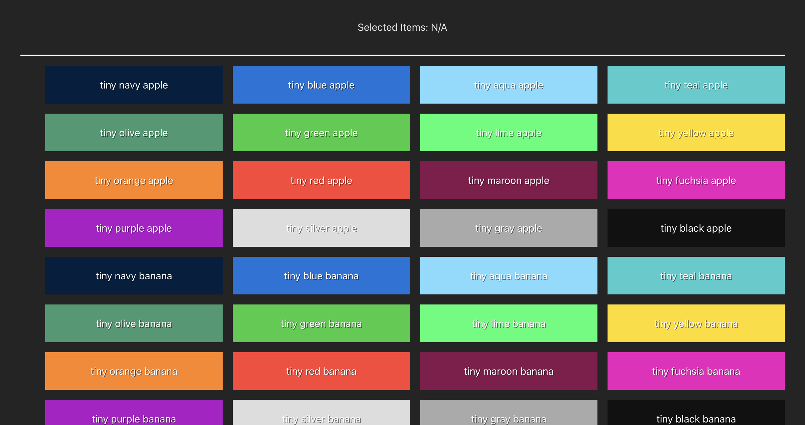
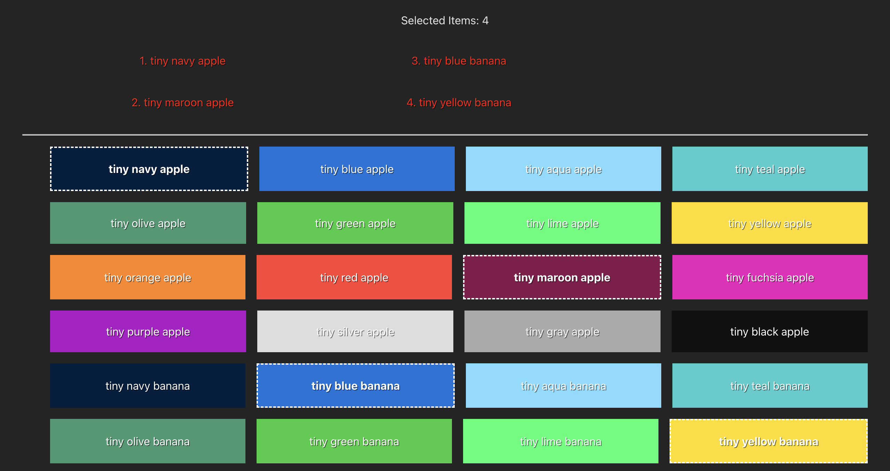

## coding test for "close"

### Task
Implement a feature to allow item selection with the following requirements:

1. Clicking an item selects/unselects it.

2. Multiple items can be selected at a time.

3. Make sure to avoid unnecessary re-renders of each list item in the big list (performance).

4. Currently selected items should be visually highlighted.

5. Currently selected items' names should be shown at the top of the page.

---

### Link
https://www.close.com/careers?ashby_jid=9cee96e9-52ef-481f-87ab-40c69ccbac38

### Improvements

- improve border on the selected items
- put highlighted list in box/accordion
- better styling for item when selected
- can implement useref/usememo later on

### Screenshots

